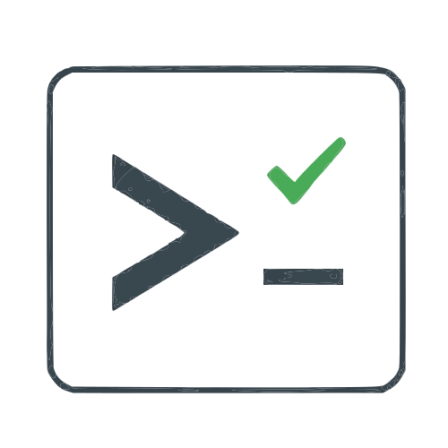

<p align="center">
  
</p>

# Selenium CLI

An interactive REPL and one-shot command-line interface that exposes **Selenium WebDriver** as simple shell commands. Every response is structured **JSON**, making it easy to pipe into `jq`, log to files, or integrate with other tooling.

```

         #################################################################        
       ####                                                             ####      
     ###                                                                  ###     
     ###                                                        +++++     ###     
     ###                                                      ++++++      ###     
     ###       ####                                         ++++++        ###     
     ###       #######                             +++     ++++++         ###     
     ###       ##########                         ++++++ ++++++           ###     
     ###       #############                       +++++++++++            ###     
     ###        ###############                      +++++++              ###     
     ###            ##############                    +++++               ###     
     ###              ###############                                     ###     
     ###                 ###############                                  ###     
     ###                    ##############                                ###     
     ###                       ##############                             ###     
     ###                    ################                              ###     
     ###                  ###############                                 ###     
     ###               ##############                                     ###     
     ###            ##############                                        ###     
     ###        ################                 ###################      ###     
     ###       #############                     ###################      ###     
     ###       ###########                                                ###     
     ###       ########                                                   ###     
     ###       #####                                                      ###                                                                       
     ###                                                                  ###
       ###                                                               ###
        ###################################################################
           
     Selenium CLI  v1.0.0                                                                                                                           
     Type 'help' or '--help' for usage
     Type 'exit' to leave
     
selenium> open https://google.com
{
  "status": "success",
  "command": "open",
  "args": ["https://google.com"],
  "result": "https://www.google.com/",
  "sessionId": "abc123...",
  "timestamp": "2026-03-18T10:00:00Z"
}
```

---

## Table of Contents

- [Features](#features)
- [Prerequisites](#prerequisites)
- [Building from Source](#building-from-source)
- [Installation](#installation)
- [Quick Start](#quick-start)
- [Usage Modes](#usage-modes)
  - [REPL (Interactive) Mode](#repl-interactive-mode)
  - [One-Shot Mode](#one-shot-mode)
  - [Piped / Scripted Mode](#piped--scripted-mode)
- [Startup Options Display](#startup-options-display)
- [Session Recording](#session-recording)
- [Tab-Completion](#tab-completion)
- [Commands Reference](#commands-reference)
  - [open](#open)
  - [click](#click)
  - [dblclick](#dblclick)
  - [rightclick](#rightclick)
  - [type](#type)
  - [clear](#clear)
  - [submit](#submit)
  - [select](#select)
  - [keys](#keys)
  - [gettext](#gettext)
  - [getattr](#getattr)
  - [hover](#hover)
  - [dragdrop](#dragdrop)
  - [scroll](#scroll)
  - [highlight](#highlight)
  - [screenshot](#screenshot)
  - [navigate](#navigate)
  - [wait](#wait)
  - [execute](#execute)
  - [switchframe](#switchframe)
  - [switchwindow](#switchwindow)
  - [tabs](#tabs)
  - [url](#url)
  - [title](#title)
  - [config](#config)
  - [session](#session)
  - [run](#run)
  - [history](#history)
  - [quit](#quit)
  - [exit (REPL only)](#exit-repl-only)
- [Locator Syntax](#locator-syntax)
- [JSON Output Format](#json-output-format)
- [Batch Execution (JSON Scripts)](#batch-execution-json-scripts)
- [Configuration](#configuration)
- [Examples](#examples)
- [Troubleshooting](#troubleshooting)
- [License](#license)

---

## Features

- **Interactive REPL** — explore and automate browsers conversationally
- **Startup options display** — on launch, every option is printed as ENABLED or disabled
- **Session recording (on by default)** — every REPL session is automatically saved as a replayable JSON file; disable with `--no-record`
- **Tab-completion** — press `Tab` for command names, options, URLs, locators, and more
- **One-shot mode** — run a single command from your shell and exit
- **Batch execution** — run a sequence of commands from a JSON file (`run --json`)
- **Structured JSON output** — every command returns a consistent JSON envelope
- **Smart locators** — auto-detects XPath, CSS, `#id`, `.class` shorthand
- **Zero driver management** — Selenium Manager automatically downloads ChromeDriver and Chrome for Testing
- **Rich configuration** — headless, incognito, proxy, custom headers (CDP), window size, and more
- **Config persistence** — settings saved to `.selenium-cli.json` so they carry across invocations
- **Single fat JAR** — no external dependencies to install at runtime

---

## Prerequisites

| Requirement | Version | Notes |
|---|---|---|
| **Java JDK** | 17+ | `java -version` to check |
| **Apache Maven** | 3.8+ | Only needed to build from source |
| **Google Chrome** | Any recent | Selenium Manager auto-downloads Chrome for Testing if needed |

> **Note:** You do **not** need to download ChromeDriver manually. Selenium Manager resolves the correct ChromeDriver and Chrome for Testing binaries automatically.

---

## Building from Source

```bash
git clone <repo-url> selenium-cli
cd selenium-cli
mvn clean package
```

The fat JAR is produced at `target/selenium-cli-1.0.0.jar`.

---

## Installation

### Option 1: Use the wrapper scripts

Add the project root to your `PATH`:

**Windows:**
```batch
set PATH=%PATH%;C:\TestAutomation\selenium-cli
selenium open https://google.com
```

**Linux / macOS / Git Bash:**
```bash
export PATH="$PATH:/path/to/selenium-cli"
selenium open https://google.com
```

### Option 2: Run the JAR directly

```bash
java -jar target/selenium-cli-1.0.0.jar [command] [args...]
```

### Option 3: Create an alias

```bash
# Bash / Zsh
alias selenium='java -jar /path/to/selenium-cli/target/selenium-cli-1.0.0.jar'

# PowerShell
Set-Alias selenium 'java -jar C:\TestAutomation\selenium-cli\target\selenium-cli-1.0.0.jar'
```

---

## Quick Start

```bash
# Start the interactive REPL
selenium

# Or pre-configure and enter the REPL in one go
selenium config --headless --window-size 1920x1080

# Or run a single command (one-shot mode — exits after execution)
selenium open https://google.com
selenium screenshot home.png
selenium quit
```

Inside the REPL:

```
selenium> open https://google.com
selenium> type "input[name='q']" "Selenium CLI"
selenium> click "input[value='Google Search']"
selenium> screenshot search-results.png
selenium> quit
selenium> exit
```

---

## Usage Modes

### REPL (Interactive) Mode

Launch without arguments to enter the interactive REPL:

```bash
selenium
```

Or **pre-configure and enter the REPL** in a single command:

```bash
selenium config --headless --window-size 1920x1080
```

This applies the config and drops straight into the REPL with those settings active.

```bash
# Combine startup flags with config
selenium --no-record config --headless --incognito
```

- Type commands at the `selenium>` prompt
- Type `help` to see all available commands
- Type `exit` to close the session and leave the REPL
- Press `Ctrl+C` — the shutdown hook automatically closes the browser

### One-Shot Mode

Pass a command and its arguments directly:

```bash
selenium open https://example.com
selenium screenshot page.png
selenium quit
```

Each invocation starts a fresh JVM. The process exits with code `0` on success, `1` on error.

### Piped / Scripted Mode

```bash
echo open https://google.com | selenium
```

```bash
(
echo open https://example.com
echo screenshot example.png
echo quit
) | selenium
```

---

## Startup Options Display

When the REPL starts, a status block is printed after the banner showing the current state of **every option**:

```
     ── Startup Options ──────────────────────────
     Session Recording    : ENABLED
     Headless             : disabled
     Maximize             : disabled
     Incognito            : disabled
     Window Size          : off
     User Data Dir        : off
     Proxy                : off
     Browser Version      : off
     Extra Headers        : off
     Chrome Arguments     : off
     ─────────────────────────────────────────────
     Use 'config --<option> true/false' to change at runtime
     Use 'config --show' to view current settings
```

- **ENABLED** (green) — the option is active
- **disabled / off** (dim) — the option is not set

### Changing Options at Runtime

All options can be **toggled on or off** during a live session using the `config` command:

| Option | Enable | Disable |
|---|---|---|
| Session Recording | `config --record` | `config --record false` |
| Headless | `config --headless` | `config --headless false` |
| Maximize | `config --maximize` | `config --maximize false` |
| Incognito | `config --incognito` | `config --incognito false` |
| Window Size | `config --window-size 1920x1080` | *(set before next session)* |
| Proxy | `config --proxy http://host:port` | *(set before next session)* |
| Browser Version | `config --browser-version 124` | *(set before next session)* |

Use `config --show` to see the current state of all options, or `config --help` for all available flags.

---

## Session Recording

By default, every REPL session **automatically records** all executed commands to a JSON file. The file uses the **same format** as the `run --json` input, so you can replay any session.

### How It Works

1. When the REPL starts, recording begins automatically
2. Meta-commands (`help`, `exit`, `session`, `run`) are excluded — only browser actions are recorded
3. **Failed commands are excluded** — only successful commands are saved, so replaying the session won't reproduce errors
4. When the session ends (`exit`, `Ctrl+D`, or `Ctrl+C`), the recording is saved to `session-<timestamp>.json`

> **Tip:** If your recording doesn't end with `quit`, add it manually before replaying — otherwise the browser will stay open after `run --json` finishes.

### Example

```
selenium> open https://google.com
selenium> type "input[name='q']" "Selenium CLI"
selenium> screenshot search.png
selenium> quit
selenium> exit
{"session_recorded": "C:\\...\\session-2026-03-31_14-30-00.json"}
```

The saved file:

```json
[
  { "command": "open", "args": ["https://google.com"] },
  { "command": "type", "args": ["input[name='q']", "Selenium CLI"] },
  { "command": "screenshot", "args": ["search.png"] },
  { "command": "quit", "args": [] }
]
```

### Replaying a Recorded Session

```bash
selenium run --json session-2026-03-31_14-30-00.json
```

### Disabling Recording

**At startup:**
```bash
selenium --no-record
```

**At runtime:**
```
selenium> config --record false      ← disable
selenium> config --record true       ← re-enable
```

---

## Tab-Completion

Press `Tab` at any point in the REPL for context-aware suggestions:

```
selenium> <Tab>                             ← shows all commands
selenium> sc<Tab>                           ← narrows to 'screenshot'
selenium> open <Tab>                        ← suggests URLs
selenium> open https://... --options <Tab>  ← suggests Chrome flags
selenium> navigate <Tab>                    ← back, forward, refresh
selenium> config --window-size <Tab>        ← common viewport sizes
selenium> getattr #logo <Tab>              ← HTML attributes
```

As you type, inline parameter hints appear showing what argument comes next.

---

## Commands Reference

### `open`

Navigate to a URL. **Automatically starts a Chrome session** if none is active.

```
open <url> [--options <chrome-args>]
```

| Parameter | Required | Description |
|---|---|---|
| `url` | Yes | The URL to navigate to |
| `--options` | No | Comma-separated Chrome arguments (only applied on new session) |

**Examples:**

```bash
selenium> open https://google.com
selenium> open https://example.com --options --start-maximized,--disable-gpu
selenium> open file:///C:/tests/page.html
```

---

### `click`

Click an element identified by a [locator](#locator-syntax).

```
click <locator>
```

**Examples:**

```bash
selenium> click #submit-btn
selenium> click .btn-primary
selenium> click //button[@id='login']
selenium> click "input[type='submit']"
```

---

### `dblclick`

Double-click an element.

```
dblclick <locator>
```

**Examples:**

```bash
selenium> dblclick #row-1
selenium> dblclick .editable-cell
```

---

### `rightclick`

Right-click (context click) an element to open context menus.

```
rightclick <locator>
```

**Examples:**

```bash
selenium> rightclick #canvas
selenium> rightclick .context-menu-target
```

---

### `type`

Type text into an input element.

```
type <locator> <text> [--clear]
```

| Parameter | Required | Description |
|---|---|---|
| `locator` | Yes | Element locator |
| `text` | Yes | Text to type (quote if it contains spaces) |
| `--clear` | No | Clear the field before typing |

**Examples:**

```bash
selenium> type #email user@test.com
selenium> type #email "new-user@test.com" --clear
selenium> type "input[name='password']" "my secret"
```

---

### `clear`

Clear the content of an input or textarea field.

```
clear <locator>
```

**Examples:**

```bash
selenium> clear #email
selenium> clear "input[name='search']"
```

---

### `submit`

Submit a form. Works on the form element itself or any element inside a form.

```
submit <locator>
```

**Examples:**

```bash
selenium> submit #login-form
selenium> submit #username
```

---

### `select`

Select an option from a `<select>` dropdown by visible text, value, or index.

```
select <locator> [text] [--value <val>] [--index <n>]
```

| Parameter | Required | Description |
|---|---|---|
| `locator` | Yes | Locator for the `<select>` element |
| `text` | No | Visible text of the option |
| `--value` | No | Option `value` attribute |
| `--index` | No | Zero-based option index |

**Examples:**

```bash
selenium> select #country "United States"
selenium> select #country --value us
selenium> select #country --index 3
```

---

### `keys`

Send special keyboard keys or key combinations to the active element or a specific element.

```
keys <key> [--to <locator>]
```

Supports: `ENTER`, `TAB`, `ESCAPE`, `BACKSPACE`, `DELETE`, `SPACE`, arrow keys (`UP`, `DOWN`, `LEFT`, `RIGHT`), `HOME`, `END`, `PAGEUP`, `PAGEDOWN`, `F1`–`F12`, and combos like `CONTROL+a`, `CONTROL+c`, `SHIFT+TAB`.

**Examples:**

```bash
selenium> keys ENTER
selenium> keys TAB
selenium> keys ESCAPE
selenium> keys CONTROL+a
selenium> keys CONTROL+c
selenium> keys --to #search ENTER
```

---

### `gettext`

Get the visible text content of an element.

```
gettext <locator>
```

**Examples:**

```bash
selenium> gettext h1
selenium> gettext .page-title
selenium> gettext //div[@class='message']
```

---

### `getattr`

Get the value of an HTML attribute on an element.

```
getattr <locator> <attribute>
```

**Examples:**

```bash
selenium> getattr #logo src
selenium> getattr "//input[@name='q']" value
selenium> getattr .main-link href
```

---

### `hover`

Move the mouse over an element (hover). Useful for triggering dropdown menus and tooltips.

```
hover <locator>
```

**Examples:**

```bash
selenium> hover .dropdown-toggle
selenium> hover #menu-item
selenium> hover "nav > ul > li:first-child"
```

---

### `dragdrop`

Drag one element and drop it onto another.

```
dragdrop <source-locator> <target-locator>
```

**Examples:**

```bash
selenium> dragdrop #source #target
selenium> dragdrop .draggable .droppable
```

---

### `scroll`

Scroll the page by pixels, to an element, or to the top/bottom.

```
scroll [--down N] [--up N] [--left N] [--right N] [--to <locator>] [--top] [--bottom]
```

| Option | Description |
|---|---|
| `--down <px>` | Scroll down by N pixels |
| `--up <px>` | Scroll up by N pixels |
| `--right <px>` | Scroll right by N pixels |
| `--left <px>` | Scroll left by N pixels |
| `--to <locator>` | Scroll to bring an element into view |
| `--top` | Scroll to the top of the page |
| `--bottom` | Scroll to the bottom of the page |

**Examples:**

```bash
selenium> scroll --down 500
selenium> scroll --up 300
selenium> scroll --right 200
selenium> scroll --to #footer
selenium> scroll --bottom
selenium> scroll --top
```

---

### `highlight`

Highlight an element with a colored border. Useful for visual debugging.

```
highlight <locator> [--color <color>] [--duration <seconds>]
```

| Option | Default | Description |
|---|---|---|
| `--color` | `red` | Border color (any CSS color) |
| `--duration` | `3` | How long to show the highlight (seconds) |

**Examples:**

```bash
selenium> highlight #login-btn
selenium> highlight .error-msg --color red
selenium> highlight #logo --color blue --duration 5
selenium> highlight "input[name='q']" --color green
```

---

### `screenshot`

Capture a screenshot of the current page.

```
screenshot [filepath]
```

Default filepath is `screenshot.png`. Parent directories are created automatically.

**Examples:**

```bash
selenium> screenshot
selenium> screenshot home-page.png
selenium> screenshot ./captures/checkout-step-3.png
```

---

### `navigate`

Browser navigation controls.

```
navigate <direction>
```

| Direction | Description |
|---|---|
| `back` | Go to the previous page |
| `forward` | Go to the next page |
| `refresh` | Reload the current page |

---

### `wait`

Pause execution for a specified number of seconds.

```
wait <seconds>
```

---

### `execute`

Execute arbitrary JavaScript in the current page context.

```
execute <script>
```

**Examples:**

```bash
selenium> execute "return document.title"
selenium> execute "document.querySelector('h1').style.color='red'"
selenium> execute "window.scrollTo(0, document.body.scrollHeight)"
```

If the script returns a value (via `return`), it is included in the JSON `result` field.

---

### `switchframe`

Switch the driver context to an iframe, or back to the main document.

```
switchframe [locator] [--index <n>] [--parent] [--main]
```

| Option | Description |
|---|---|
| `<locator>` | Switch to frame by element locator |
| `--index <n>` | Switch to frame by zero-based index |
| `--parent` | Switch to the parent frame |
| `--main` | Switch back to the top-level document |

**Examples:**

```bash
selenium> switchframe #my-iframe
selenium> switchframe --index 0
selenium> switchframe --parent
selenium> switchframe --main
```

---

### `switchwindow`

Switch between browser windows/tabs, open a new tab, or close the current one.

```
switchwindow [handle] [--next] [--previous] [--new] [--close]
```

| Option | Description |
|---|---|
| `--next` | Switch to the next tab |
| `--previous` | Switch to the previous tab |
| `--new` | Open a new blank tab |
| `--close` | Close the current tab and switch to the remaining one |
| `<handle>` | Switch to a specific window handle |

**Examples:**

```bash
selenium> switchwindow --next
selenium> switchwindow --previous
selenium> switchwindow --new
selenium> switchwindow --close
```

---

### `tabs`

List all open browser tabs/windows with their handles, titles, and URLs.

```
tabs
```

---

### `url`

Print the current page URL.

```
url
```

---

### `title`

Print the current page title.

```
title
```

---

### `config`

View or modify browser and CLI configuration.

```
config [options]
```

| Option | Description | Live-apply? |
|---|---|---|
| `--record [true\|false]` | Enable/disable session recording | ✅ Yes |
| `--headless [true\|false]` | Enable/disable headless mode | ❌ Next session |
| `--maximize [true\|false]` | Enable/disable maximize window | ✅ Yes |
| `--incognito [true\|false]` | Enable/disable incognito mode | ❌ Next session |
| `--window-size <WxH>` | Window size (e.g. `1920x1080`) | ❌ Next session |
| `--user-data-dir <path>` | Chrome user data directory | ❌ Next session |
| `--proxy <url>` | HTTP/S proxy (e.g. `http://host:port`) | ❌ Next session |
| `--browser-version <ver>` | Chrome version for Selenium Manager | ❌ Next session |
| `--header <Name:Value>` | Add custom HTTP header (repeatable) | ✅ Yes (via CDP) |
| `--options <args>` | Raw Chrome arguments, comma-separated | ❌ Next session |
| `--show` | Print current configuration | — |

**Examples:**

```bash
selenium> config --show
selenium> config --headless --window-size 1920x1080
selenium> config --header "Authorization:Bearer token123"
selenium> config --maximize
selenium> config --headless false
selenium> config --record false
selenium> config --incognito --proxy http://127.0.0.1:8080
```

---

### `session`

Display metadata about the active browser session.

```
session
```

---

### `run`

Execute a batch of commands from a JSON file.

```
run --json <file> [--output <file>] [--continue-on-error]
```

| Option | Required | Description |
|---|---|---|
| `--json <file>` | Yes | Path to JSON command file |
| `--output <file>` | No | Write results to file instead of stdout |
| `--continue-on-error` | No | Don't stop on first error |

See [Batch Execution](#batch-execution-json-scripts) for the JSON file format.

---

### `history`

Display all successful commands recorded in the current session. Only commands that succeeded are shown (failed commands are never recorded). Use `--clear` to reset the history.

```
history [--clear]
```

**Examples:**

```bash
selenium> history
{
  "status": "success",
  "command": "history",
  "result": {
    "recording": "enabled",
    "count": 3,
    "commands": [
      { "step": 1, "command": "open", "args": ["https://google.com"] },
      { "step": 2, "command": "click", "args": ["#login"] },
      { "step": 3, "command": "screenshot", "args": ["page.png"] }
    ]
  }
}

selenium> history --clear
```

---

### `quit`

Close the active browser session. Does **not** exit the REPL — you can start a new session with `open`.

---

### `exit` (REPL only)

Close the browser session (if active) and exit the REPL.

---

## Locator Syntax

The CLI supports flexible element locators with auto-detection:

| Syntax | Strategy | Example |
|---|---|---|
| `#id` | `By.id` | `#submit-btn` |
| `.class` | `By.cssSelector` | `.btn-primary` |
| `//xpath` | `By.xpath` | `//button[@type='submit']` |
| `(//xpath)` | `By.xpath` | `(//div[@class='item'])[1]` |
| `css=selector` | `By.cssSelector` | `css=div.content > p` |
| `xpath=expr` | `By.xpath` | `xpath=//h1` |
| `id=value` | `By.id` | `id=email` |
| `name=value` | `By.name` | `name=username` |
| `tag=value` | `By.tagName` | `tag=h1` |
| *(anything else)* | `By.cssSelector` | `input[type='email']` |

> **Tips:** Prefer `#id` when the element has a unique ID. Use quotes around complex CSS selectors. Explicit prefixes (`css=`, `xpath=`, `id=`, `name=`, `tag=`) override auto-detection.

---

## JSON Output Format

Every command produces a consistent JSON envelope:

### Success

```json
{
  "status": "success",
  "command": "open",
  "args": ["https://google.com"],
  "result": "https://www.google.com/",
  "sessionId": "d5f2a1b0c...",
  "timestamp": "2026-03-18T10:05:30.123Z"
}
```

### Error

```json
{
  "status": "error",
  "command": "click",
  "args": ["#nonexistent"],
  "error": "no such element: Unable to locate element: ...",
  "sessionId": "d5f2a1b0c...",
  "timestamp": "2026-03-18T10:05:32.456Z"
}
```

| Field | Type | Description |
|---|---|---|
| `status` | `string` | `"success"` or `"error"` |
| `command` | `string` | The command that was executed |
| `args` | `string[]` | Arguments passed to the command |
| `result` | `any` | Command-specific result, or `null` on error |
| `sessionId` | `string?` | Active WebDriver session ID, or `null` |
| `timestamp` | `string` | ISO-8601 timestamp |
| `error` | `string?` | Error message, or `null` on success |

---

## Batch Execution (JSON Scripts)

The `run` command accepts a JSON array of command objects:

```json
[
  { "command": "open",       "args": ["https://www.google.com"] },
  { "command": "screenshot", "args": ["google-home.png"] },
  { "command": "gettext",    "args": ["body"] },
  { "command": "quit",       "args": [] }
]
```

```bash
# Run and print results to stdout
selenium run --json examples/test.json

# Save results to a file
selenium run --json examples/test.json --output results.json

# Continue past failures
selenium run --json examples/test.json --continue-on-error
```

By default, execution **stops on the first error**. Use `--continue-on-error` to execute all commands regardless.

---

## Configuration

### Config Persistence

The `config` command persists settings to a **`.selenium-cli.json`** file in the current working directory. This means config set in one command carries to the next:

```bash
# Creates .selenium-cli.json
selenium config --headless --window-size 1920x1080

# Loads .selenium-cli.json → opens headless at 1920×1080
selenium open https://example.com

# Cleans up and deletes .selenium-cli.json
selenium quit
```

### Config Lifecycle

1. **Before a session** — `config` stores settings in memory and persists to `.selenium-cli.json`
2. **Across invocations** — `.selenium-cli.json` is loaded automatically on startup
3. **Session starts** — `open` reads the config and builds Chrome options
4. **During a session** — Only `--maximize` and `--header` apply immediately; others take effect on the next session
5. **On quit** — All config is reset and `.selenium-cli.json` is deleted

### Headless Mode

```bash
selenium> config --headless --window-size 1920x1080
selenium> open https://example.com
selenium> screenshot headless-capture.png
selenium> quit
```

### Proxy Configuration

```bash
selenium> config --proxy http://127.0.0.1:8080
selenium> open https://example.com
```

### Custom HTTP Headers (CDP)

Headers are injected via Chrome DevTools Protocol and apply to **all requests**:

```bash
selenium> config --header "Authorization:Bearer eyJhbGciOi..."
selenium> config --header "X-Request-Id:test-123"
```

### Specific Chrome Version

```bash
selenium> config --browser-version 124
selenium> open https://example.com
```

---

## Examples

### Login Flow

```bash
selenium> open https://myapp.com/login
selenium> type #username admin
selenium> type #password "s3cret!" --clear
selenium> click #login-btn
selenium> wait 2
selenium> gettext .welcome-message
selenium> screenshot after-login.png
```

### Scrape Text from a Page

```bash
selenium> open https://news.ycombinator.com
selenium> gettext .titleline
selenium> getattr .titleline a href
selenium> execute "return document.querySelectorAll('.titleline').length"
```

### Headless Screenshot Pipeline

```bash
selenium config --headless --window-size 1920x1080
selenium open https://example.com
selenium screenshot example.png
selenium quit
```

Or as a batch file:

```json
[
  { "command": "config", "args": ["--headless", "--window-size", "1920x1080"] },
  { "command": "open",   "args": ["https://example.com"] },
  { "command": "screenshot", "args": ["example-headless.png"] },
  { "command": "quit",   "args": [] }
]
```

```bash
selenium run --json headless-capture.json --output report.json
```

### Batch File with Error Handling

```bash
# Stops at the first error:
selenium run --json test.json

# Continues past errors:
selenium run --json test.json --continue-on-error
```

### Pipe with jq

```bash
selenium open https://example.com 2>&1 | jq '.result'
```

---

## Troubleshooting

### "No active session available. Use 'open <url>' to start one."

Call `open <url>` before any command that interacts with the browser (`click`, `type`, `gettext`, etc.).

### Chrome doesn't launch / ChromeDriver errors

- Ensure you have internet access (first run downloads binaries)
- Ensure Java 17+ is installed
- Check for conflicting `CHROMEDRIVER` environment variables

### "A session is already active"

Only one browser session is allowed at a time. Call `quit` before starting a new one.

### Headless mode shows blank screenshots

Always set a window size with headless mode:

```bash
selenium> config --headless --window-size 1920x1080
```

### Config changes not taking effect

Most config options only apply when a **new session** starts. Quit the current session first:

```bash
selenium> quit
selenium> config --headless --incognito
selenium> open https://example.com
```

### Colors appear as garbled escape codes

If you see `[36m` instead of colors, your terminal does not support ANSI. This is rare on modern systems (Windows Terminal, PowerShell 7+, macOS Terminal, Linux terminals all support ANSI). Try a modern terminal emulator.

### Output is not valid JSON

Selenium's internal logging can sometimes leak to stdout. Redirect stderr:

```bash
selenium open https://example.com 2>/dev/null
```

---

## License

This project is provided as-is for internal test automation use.
